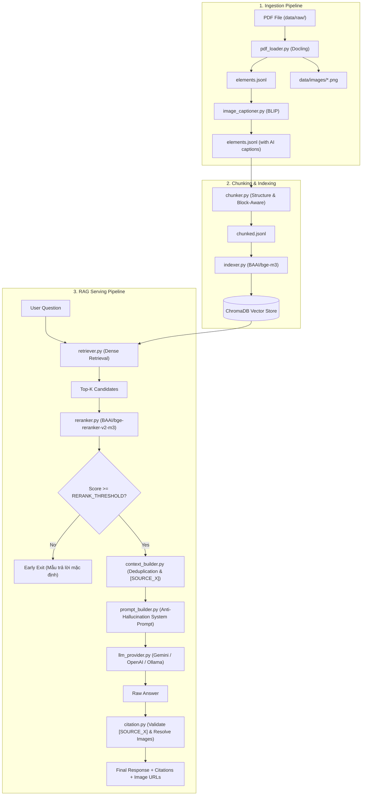

# Tổng quan Cấu trúc & Tệp tin Dự án `vi-coze` (Vietnamese Multimodal PDF RAG System)

Tài liệu này tổng hợp và mô tả chi tiết toàn bộ cấu trúc thư mục, luồng dữ liệu, và chức năng của từng file trong dự án **`vi-coze`** — Hệ thống RAG (Retrieval-Augmented Generation) đa phương thức (Multimodal) xử lý tài liệu PDF tiếng Việt.

---

## 1. Tổng quan Kiến trúc Hệ thống

Hệ thống bao gồm 2 chu trình chính:
1. **Offline Pipeline (Xử lý & Lập chỉ mục dữ liệu)**:
   - **PDF Loading**: Sử dụng `Docling` bóc tách văn bản, tiêu đề, bảng biểu (Markdown) và trích xuất file ảnh PNG thực tế (`data/images/`).
   - **Image Captioning**: Sử dụng model `Salesforce/blip-image-captioning-base` mô tả nội dung ngữ nghĩa cho hình ảnh.
   - **Structure & Block-Aware Chunking**: Chia đoạn tài liệu theo 3 tầng (Heading Boundary -> Block Packing -> Selective Splitting).
   - **Vector Indexing**: Embedding các chunk bằng `BAAI/bge-m3` và lưu trữ tại `ChromaDB`.

2. **Online Serving Pipeline (RAG Chatbot & Retrieval)**:
   - **Dense Retrieval**: Tìm kiếm top-K candidate chunks bằng vector similarity (`BAAI/bge-m3`).
   - **Cross-Encoder Re-ranking**: Tái xếp hạng câu trả lời bằng model `BAAI/bge-reranker-v2-m3` và lọc ngưỡng `RERANK_THRESHOLD`.
   - **Context Builder**: Khử trùng lặp (Deduplication), kiểm soát token budget (`MAX_CONTEXT_TOKENS`), gán mã trích dẫn `[SOURCE_X]`.
   - **Prompt Builder**: Tạo System Prompt kèm theo các quy tắc chống bịa đặt (Anti-Hallucination Guardrails).
   - **LLM Provider**: Sinh câu trả lời qua Gemini API (`gemini-2.5-flash`), OpenAI, Ollama Local hoặc Mock Provider.
   - **Citation & Image Resolution**: Kiểm tra tính hợp lệ của mã trích dẫn `[SOURCE_X]`, liên kết hình ảnh minh họa thực tế gửi về giao diện Web Dashboard (React + FastAPI).

---

## 2. Thư mục Gốc & File Cấu hình (Root)

| Đường dẫn File / Folder | Loại | Chức năng chi tiết |
| :--- | :--- | :--- |
| `[PROJECT_STRUCTURE.md](file:///d:/AI/vi-coze/PROJECT_STRUCTURE.md)` | File `.md` | Document mô tả toàn bộ cấu trúc dự án (File hiện tại). |
| `[README.md](file:///d:/AI/vi-coze/README.md)` | File `.md` | Tài liệu hướng dẫn sử dụng và thông tin tổng quan dự án. |
| `[requirements.txt](file:///d:/AI/vi-coze/requirements.txt)` | File Config | Khai báo toàn bộ thư viện Python cần thiết (`docling`, `langchain`, `chromadb`, `sentence-transformers`, `fastapi`, `uvicorn`, `transformers`, `google-genai`, `openai`, `torch`, `Pillow`, v.v.). |
| `[.env](file:///d:/AI/vi-coze/.env)` | File Config | Chứa biến môi trường (API Key, model path, threshold config). |
| `[.env.example](file:///d:/AI/vi-coze/.env.example)` | File Config | Mẫu cấu hình môi trường chuẩn cho dự án. |

---

## 3. Thư mục Dữ liệu (`data/`)

Thư mục chứa toàn bộ dữ liệu đầu vào, dữ liệu trung gian và cơ sở dữ liệu vector.

```
data/
├── raw/                      # Lưu trữ các file PDF gốc (Ví dụ: [Reading]-RAG-System.pdf)
├── processed/                # Lưu trữ các file dữ liệu trung gian dạng JSONL
│   ├── elements.jsonl        # Source of Truth: Toàn bộ elements bóc tách từ PDF + BLIP Captions
│   ├── pdf_extract.jsonl     # Dữ liệu trích xuất theo trang (backward compatibility)
│   ├── chunked.jsonl         # Danh sách các chunks sau khi thực hiện Chunking
│   ├── image_metadata.jsonl  # Thống kê danh sách hình ảnh đã trích xuất
│   └── image_captions.jsonl  # Cache kết quả caption hình ảnh từ BLIP
├── images/                   # Thư mục chứa hình ảnh PNG thực tế trích xuất từ PDF
│   └── <document_id>/        # Ảnh PNG từng tài liệu (ví dụ: fig_001.png, fig_002.png)
└── vectorstore/
    └── chroma/               # Thư mục lưu trữ database ChromaDB tại chỗ (local persistence)
```

---

## 4. Thư mục Xử lý Dữ liệu (`src/data/`)

Chịu trách nhiệm bóc tách PDF, tạo mô tả ảnh, phân đoạn tài liệu (Chunking) thông minh theo cấu trúc.

| File | Chức năng chính |
| :--- | :--- |
| `[pdf_loader.py](file:///d:/AI/vi-coze/src/data/pdf_loader.py)` | Phân tích PDF bằng **Docling**. Xuất elements ra `data/processed/elements.jsonl` và cắt ảnh PNG thực tế lưu vào `data/images/<document_id>/`. |
| `[image_captioner.py](file:///d:/AI/vi-coze/src/data/image_captioner.py)` | Lọc ảnh rác (<100x100px). Sử dụng `Salesforce/blip-image-captioning-base` để tạo mô tả ảnh tự động và cập nhật trường `ai_caption` trong `elements.jsonl`. |
| `[section_builder.py](file:///d:/AI/vi-coze/src/data/section_builder.py)` | **Tầng 1 Chunking**: Phân tích cấp độ tiêu đề (H1, H2, H3) để thiết lập ranh giới cứng (Hard Section Boundary). |
| `[block_normalizer.py](file:///d:/AI/vi-coze/src/data/block_normalizer.py)` | Chuẩn hóa các phần tử thô thành cấu trúc `Block` đồng nhất (Paragraph, Table, Image). |
| `[block_packer.py](file:///d:/AI/vi-coze/src/data/block_packer.py)` | **Tầng 2 & 3 Chunking**: Đóng gói các Block theo token budget, áp dụng overlap và gọi các module chia nhỏ nếu vượt quá hạn mức token. |
| `[table_splitter.py](file:///d:/AI/vi-coze/src/data/table_splitter.py)` | Chia nhỏ các bảng Markdown lớn theo từng dòng nhưng vẫn giữ nguyên dòng tiêu đề (Header Row) ở mỗi chunk. |
| `[paragraph_splitter.py](file:///d:/AI/vi-coze/src/data/paragraph_splitter.py)` | Chia nhỏ đoạn văn bản dài một cách đệ quy theo dấu câu hoặc câu hoàn chỉnh. |
| `[metadata_builder.py](file:///d:/AI/vi-coze/src/data/metadata_builder.py)` | Gán metadata chuẩn hóa cho từng chunk (`chunk_id`, `source`, `page`, `section_path`, `image_paths`, `token_count`). |
| `[chunker.py](file:///d:/AI/vi-coze/src/data/chunker.py)` | Master Orchestrator phối hợp `section_builder`, `block_normalizer`, `block_packer` và `metadata_builder`. |
| `[chunker_optimized.py](file:///d:/AI/vi-coze/src/data/chunker_optimized.py)` | Interface wrapper cho pipeline chunking, hỗ trợ nhận tham số `ChunkConfig` qua CLI hoặc API. |
| `[token_counter.py](file:///d:/AI/vi-coze/src/data/token_counter.py)` | Hàm bổ trợ đếm số lượng token bằng thư viện `tiktoken` (cl100k_base). |
| `[inspect_chunks.py](file:///d:/AI/vi-coze/src/data/inspect_chunks.py)` | Công cụ CLI kiểm tra thống kê chunks, độ dài token, xem trước nội dung chunk. |
| `[image_extractor.py](file:///d:/AI/vi-coze/src/data/image_extractor.py)` | Utility hỗ trợ crop/trích xuất ảnh từ tài liệu. |
| `[merge_documents.py](file:///d:/AI/vi-coze/src/data/merge_documents.py)` | Utility gộp nhiều luồng elements tài liệu. |

---

## 5. Thư mục RAG Core Subsystem (`src/rag/`)

Thư mục trung tâm điều phối toàn bộ quy trình RAG Search & LLM Generation.

```
src/rag/
├── indexer.py               # Lập chỉ mục Vector: Embed chunks (BAAI/bge-m3) & lưu ChromaDB
├── retriever.py             # Nạp ChromaDB và thực hiện Dense Vector Similarity Search
├── reranker.py              # Cross-Encoder Re-ranking (BAAI/bge-reranker-v2-m3) + RERANK_THRESHOLD
├── context_builder.py       # Deduplication, kiểm soát MAX_CONTEXT_TOKENS, gán nhãn [SOURCE_X]
├── prompt_builder.py        # Tạo System Prompt & User Prompt với quy tắc Anti-Hallucination
├── citation.py              # Validate nhãn [SOURCE_X], lọc trích dẫn ảo, map đường dẫn ảnh PNG
├── rag_pipeline.py          # Master RAG Orchestrator (Luồng chạy end-to-end Online Serving)
└── llm/                     # Subsystem kết nối các mô hình ngôn ngữ lớn (LLMs)
    ├── __init__.py          # Factory method get_llm_provider()
    ├── base.py              # Class cơ sở BaseLLMProvider
    ├── gemini_provider.py   # Tích hợp Google Gemini API (gemini-2.5-flash)
    ├── openai_provider.py   # Tích hợp OpenAI API (gpt-4o-mini, gpt-4o)
    ├── ollama_provider.py   # Tích hợp Ollama cho mô hình chạy local
    └── mock_provider.py     # Mock LLM dùng khi test offline hoặc không có API Key
```

---

## 6. Server backend FastAPI (`src/app.py`)

File `src/app.py` cung cấp Web API RESTful để kết nối Backend Python với Frontend React.

**Các API Endpoints chính**:
- `GET /health`: Kiểm tra trạng thái server & thiết bị tính toán (CUDA/CPU).
- `GET /api/files`: Lấy danh sách các file PDF sẵn có trong `data/raw/`.
- `GET /api/pipeline/status`: Lấy thống kê số lượng documents, elements, chunks, vectors hiện có.
- `POST /api/pipeline/load`: Chạy giai đoạn 1 (PDF Ingestion -> Elements -> BLIP Captions).
- `POST /api/pipeline/chunk`: Chạy giai đoạn 2 (Elements -> Structure-Aware Chunks).
- `POST /api/pipeline/embed`: Chạy giai đoạn 3 (Chunks -> Embedding & lưu ChromaDB).
- `POST /api/retrieval/search`: Thực hiện tìm kiếm Vector Top-K cho câu hỏi người dùng.
- `POST /api/rag/chat`: Chạy trọn vẹn Pipeline RAG End-to-End (Retrieval -> Rerank -> Prompt -> LLM -> Citations & Images).
- Static Route `/images`: Serve trực tiếp các file ảnh PNG đã trích xuất tại `data/images/`.

---

## 7. Thư mục Frontend Dashboard (`frontend/`)

Ứng dụng Single Page Application (SPA) xây dựng bằng **React + Vite**, cung cấp giao diện trực quan theo dõi toàn bộ pipeline.

```
frontend/
├── index.html            # HTML Entry point
├── package.json          # Quản lý dependency Frontend (React, Vite, Lucide-React)
└── src/
    ├── main.jsx          # Giao diện điều khiển Pipeline, đếm thời gian, chạy Retrieval & RAG Chat
    └── styles.css        # Theme giao diện tối (Dark Modern Console Style)
```

---

## 8. Sơ đồ Luồng Dữ liệu (Data Flow Diagram)



---

## 9. Tóm tắt Tiêu chuẩn & Hướng dẫn Sử dụng

1. **Chạy thử Backend (FastAPI)**:
   ```bash
   uvicorn src.app:app --reload --port 5000
   ```
2. **Chạy thử Frontend (React)**:
   ```bash
   cd frontend
   npm run dev
   ```
3. **Chạy Pipeline RAG qua Terminal**:
   ```bash
   python src/rag/rag_pipeline.py --query "Mô tả kiến trúc RAG" --provider gemini
   ```
